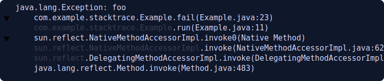

# 📚 stacktrace

[](https://github.com/azriel91/stacktrace/actions/workflows/ci.yml)

`stacktrace` helps you see the relevant parts of a stack trace.




## Development

1. Clone the repository.

    ```bash
    git clone git@github.com:azriel91/stacktrace.git
    cd stacktrace
    ```

2. Install [trunk](https://trunkrs.dev/):

    ```bash
    cargo install --locked trunk
    ```

3. Run the playground:

    ```bash
    cd playground
    trunk serve -v
    ```


## Ideas

> Not in any particular order.
>
> This is indefinite -- I may not actually have the time to do them, feel free to contribute.

1. [x] Client side static web application.
2. [x] Collapsible frames.
3. [ ] Parse lines with different leading segments.
4. [ ] Collapsible segments based on common modules.
5. [ ] Detect file names, one-click copy.
6. [ ] Rename this, so it can be published on `crates.io` and used as a library.


## License

Licensed under either of

* Apache License, Version 2.0, ([LICENSE-APACHE](LICENSE-APACHE) or https://www.apache.org/licenses/LICENSE-2.0)
* MIT license ([LICENSE-MIT](LICENSE-MIT) or https://opensource.org/licenses/MIT)

at your option.


### Contribution

Unless you explicitly state otherwise, any contribution intentionally submitted for inclusion in the work by you, as defined in the Apache-2.0 license, shall be dual licensed as above, without any additional terms or conditions.

